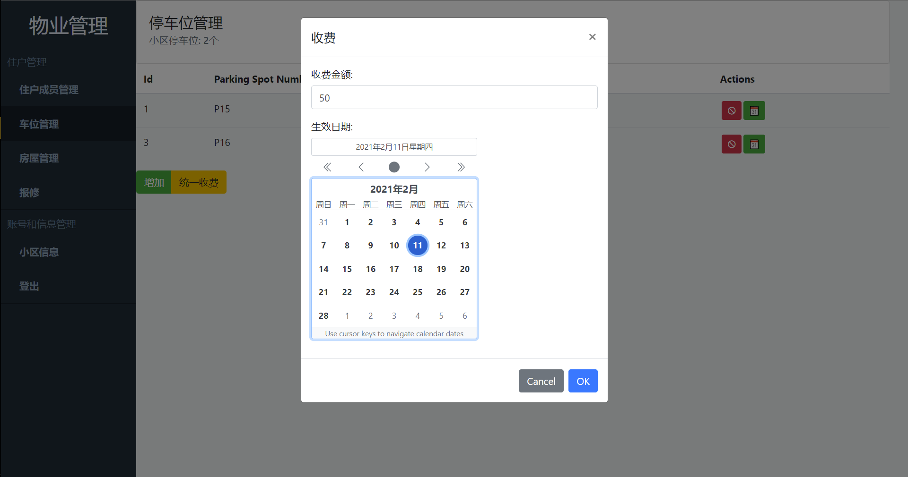

# community-management小区管理系统（学校大作业）

## 前言

本系统为在校期间的课程设计，实现管理小区业主的车位、房屋、报修、缴费等信息的集中管理、物业对于业主信息的登记、收费、维修等信息的维护

初学Vue，为了深入一点掌握，编写了这个demo

后端: https://github.com/zqqqqz2000/community-management-server.git

## 技术栈

Vue2+Bootstrap-Vue+Animejs+axios（登录页面动画及输入框等效果为手动实现，非框架提供）

## 部分截图

